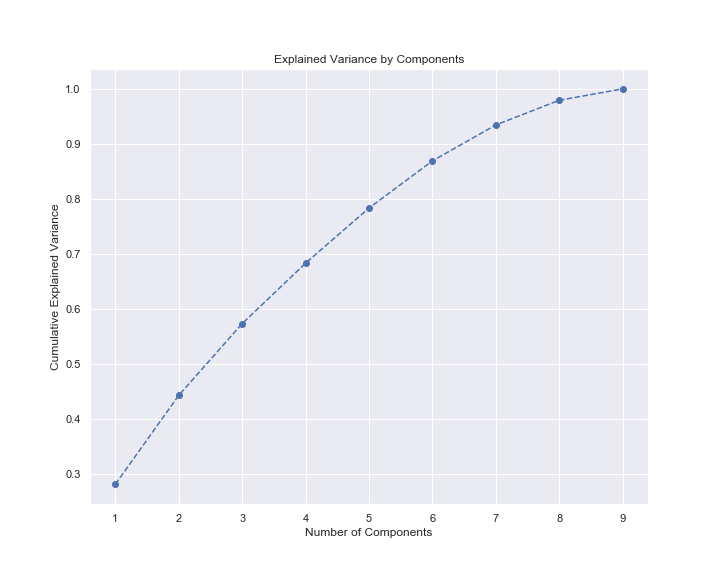
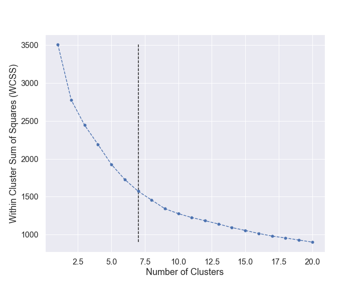
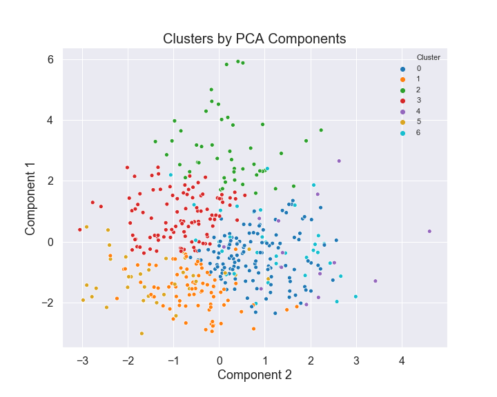
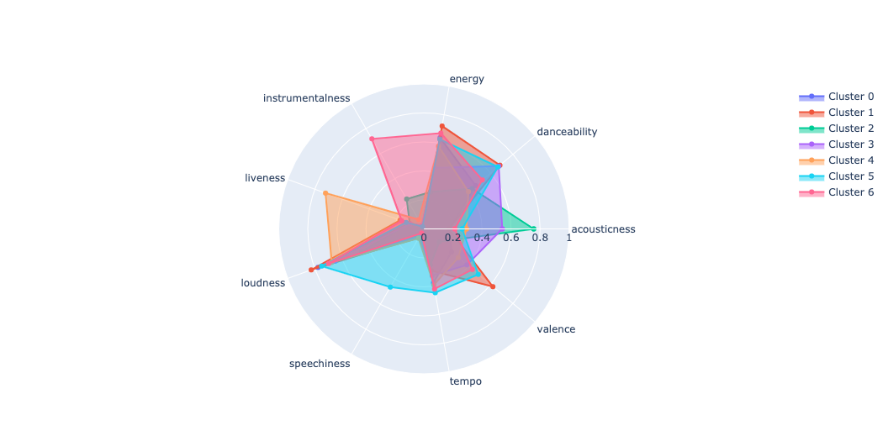

# K-Means Clustering and PCA to categorize music by similar audio features

If you have not already stumbled across my Towards Data Science article for this project, please check it out [here](https://towardsdatascience.com/k-means-clustering-and-pca-to-categorize-music-by-similar-audio-features-df09c93e8b64)!

## Source Code

Note: you must have access to the Spotify Developer API to use this repo. :)  
The technical code for this project is contained in `notebook.ipynb`.  
The web application containing user-friendly, interactive visualization code-- lives in `app.py`.  

### Running the Streamlit App Locally

1. `pip install -r requirements.txt`
2. `streamlit run app.py`

## Visualizations

 

 

